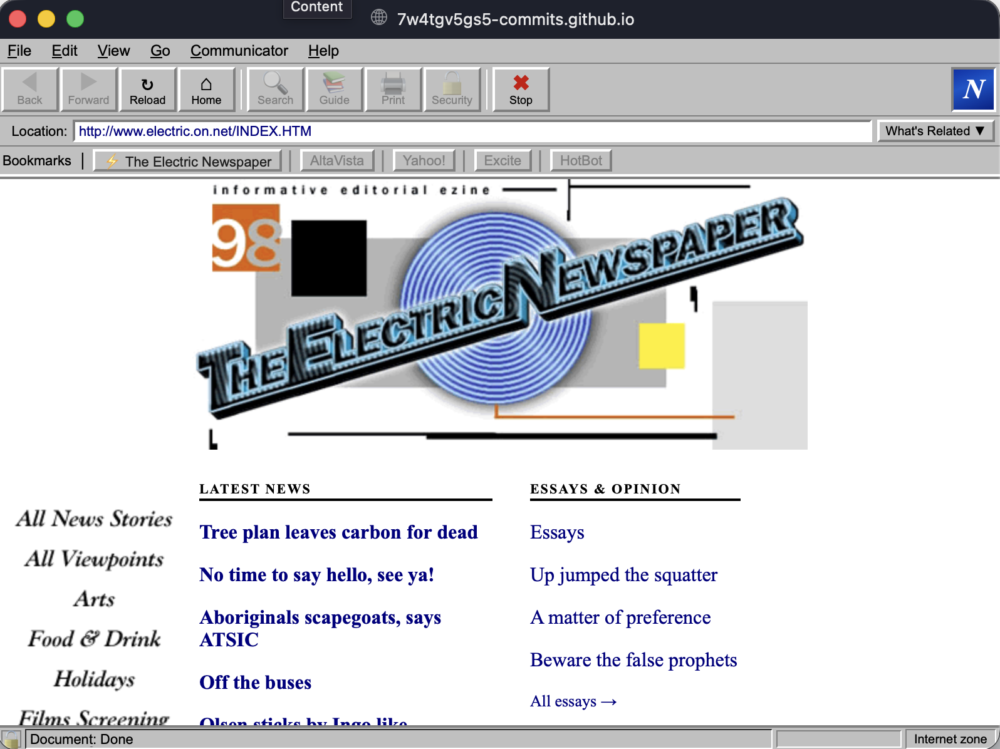

# Reviving a 1998 Newspaper with Claude
### Restoring *The Electric Newspaper* archive with Cowork & Code

Ben Moretti — Claude User Group

---

## What was *The Electric Newspaper*?

- Australia's first independent online daily — Adelaide, Feb–Jul 1998
- 711 articles across 11 sections (news, essays, sport, film, arts, fringe...)
- Produced by Virtual Artists, edited by Hendrik Gout
- Hand-coded HTML 3.2, hosted on Internode's Unix servers
- Closed after 7 months: *"No time to say hello, see ya!"*

---

## The archive sat dormant for 26 years

- Preserved as a **tar file** from the original Unix server
- Tar extraction **truncated every filename to 8 characters**
- Result: every image reference in all 711 HTML files was broken
- Many images also pointed to absolute URLs on a dead domain
- Goal: restore it, publish to GitHub Pages, submit to PANDORA/Trove

---

## The scale of the mess

- 18,000+ image references across the archive
- 14,653 needed to resolve correctly
- 144 were dead external ad URLs (left alone)
- Only **2 files** genuinely lost forever
- All of this spread across 711 hand-written HTML files

A perfect job for an agent that can read, pattern-match, and edit at scale.

---

## Where Claude Code came in

- Systematic recovery: map truncated/broken filenames back to originals
- Pattern-match across hundreds of files, rewrite paths in bulk
- Rewrote 269 absolute `electric.on.net/ads/...` URLs as relative paths
- Fixed navigation links (wrong extensions, dead domain refs)
- Disabled a 1997 Netscape rollover script for compatibility —
  **original source kept verbatim in HTML comments**

---

## One hard rule: don't touch the prose

- The 1998 article text and body HTML had to stay **completely original**
- Only permitted changes: image paths, nav links, the rollover-script fix
- This rule went straight into `CLAUDE.md` so every session honours it
- Lesson: for archival work, a written constraint file is what keeps an
  agent from "helpfully" rewriting history

---

## Where Cowork came in

- Drafting the *surrounding* site, not the 1998 content itself:
  - `index.html` — entrance page
  - `about.html` / `history.html` — context, timeline, contributor profiles
  - `restoration.html` — explaining the recovery itself
  - `articles.html` — searchable/sortable index of all 711 articles
- Cowork's strength: research-and-write tasks, README, Wikipedia draft

---

## The centerpiece: a Netscape 4 simulation

- `netscape.html` wraps the archive in a fake **Netscape Navigator 4**
  browser at 800×600 — the screen most Australians used in 1998
- Working Back/Forward history stack
- Animated Navigator "N" logo and status bar
- Location bar shows the original `electric.on.net` URLs via `toRetroURL()`
- `?page=` query param deep-links straight to any article

---

## Code vs. Cowork — how the split actually worked

| Task | Tool |
|---|---|
| Bulk file analysis, path remapping across 711 files | Claude Code |
| Writing new pages (about/history/restoration) | Cowork |
| Building `articles.html`'s JS metadata table | Code |
| Drafting README & Wikipedia article | Cowork |
| Cross-browser JS fixes, case-sensitivity audits | Code |

Rough heuristic: **repetitive + verifiable → Code, narrative + judgment → Cowork**

---

## Gotchas worth knowing

- **Case sensitivity**: original filenames are uppercase (`INDEX.HTM`).
  macOS hides this; GitHub Pages (Linux) does not — bugs only show up
  after deploy
- Iframe restrictions mean you need a local server to test
  (`python3 -m http.server`), not just opening the file
- Keeping a single `CLAUDE.md` with file structure + hard rules meant
  every new session picked up context instantly

---

## Takeaways for your own legacy-content projects

- Write your constraints down (a `CLAUDE.md` / project instructions file)
  before turning an agent loose on irreplaceable content
- Split work by *type*, not by tool brand — bulk/mechanical vs. narrative
- Preserve, don't delete: old code/scripts kept in HTML comments as
  historical record, not just disabled
- An agent can do in hours what would've been weeks of manual `grep`/`sed`

---

# Thanks!

**Live archive:** 7w4tgv5gs5-commits.github.io/electric-newspaper

Questions?

